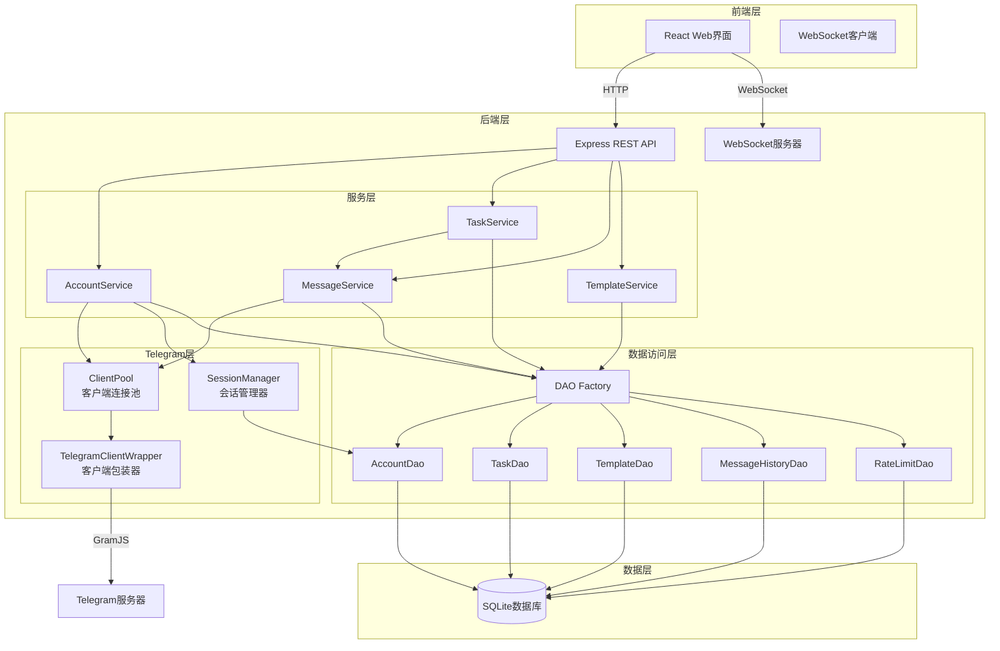

# 设计文档

## 概述

Telegram自动化管理系统是一个桌面Web应用，采用前后端分离架构，帮助用户管理多个Telegram账号，在自己拥有的频道和群组中自动发送消息和评论。系统严格遵守Telegram的速率限制和服务条款，确保账号安全。

后端使用Node.js + TypeScript + GramJS构建，通过MTProto协议与Telegram通信，使用SQLite进行数据持久化。前端使用React + TypeScript + Ant Design构建现代化管理界面。系统核心设计围绕五大模块：账号管理、任务调度、速率限制、消息发送和模板管理，通过客户端连接池和会话管理器确保高效稳定的运行。

## 架构

### 系统架构图



### 技术栈

**后端:**

- Node.js 18+ (运行时)
- TypeScript 5+ (类型安全)
- Express (REST API框架)
- GramJS (Telegram MTProto客户端)
- better-sqlite3 (SQLite数据库)
- ws (WebSocket服务器)
- node-cron (任务调度)
- winston (日志)

**前端:**

- React 18+ (UI框架)
- TypeScript 5+ (类型安全)
- Ant Design (UI组件库)
- Zustand (状态管理)
- React Router (路由)
- Axios (HTTP客户端)
- Vite (构建工具)

**开发工具:**

- pnpm (包管理器，workspace模式)
- ESLint + Prettier (代码规范)
- Jest (单元测试)
- fast-check (属性测试)

## 组件和接口

### 1. 账号管理器 (AccountManager)

负责Telegram账号的添加、认证、状态监控和会话管理。

**接口定义:**

```typescript
interface AccountManager {
  // 通过手机号添加账号
  addAccountByPhone(phoneNumber: string): Promise<AccountAddResult>;

  // 提交验证码完成登录
  submitVerificationCode(phoneNumber: string, code: string): Promise<Account>;

  // 通过会话文件导入账号
  importAccountFromSession(sessionFile: Buffer, filename: string): Promise<Account>;

  // 导出账号会话文件
  exportAccountSession(accountId: string): Promise<Buffer>;

  // 获取所有账号
  getAllAccounts(): Promise<Account[]>;

  // 获取账号详情
  getAccount(accountId: string): Promise<Account | null>;

  // 删除账号
  deleteAccount(accountId: string): Promise<void>;

  // 检查账号连接状态
  checkAccountStatus(accountId: string): Promise<AccountStatus>;

  // 获取Telegram客户端实例
  getClient(accountId: string): Promise<TelegramClient | null>;
}

interface Account {
  id: string;
  phoneNumber: string;
  username?: string;
  firstName?: string;
  lastName?: string;
  addMethod: 'phone' | 'session';
  status: 'online' | 'offline' | 'restricted';
  healthScore: number; // 0-100
  createdAt: Date;
  lastActiveAt: Date;
}

interface AccountAddResult {
  phoneNumber: string;
  phoneCodeHash: string;
  needsCode: boolean;
}

type AccountStatus = 'online' | 'offline' | 'restricted';
```

**核心逻辑:**

1. **手机号登录流程:**
   - 调用GramJS的`client.start()`方法
   - 发送验证码到用户手机
   - 等待用户输入验证码
   - 验证成功后保存会话数据

2. **会话文件导入:**
   - 解析上传的.session文件
   - 验证会话有效性
   - 使用会话数据创建TelegramClient
   - 测试连接并获取账号信息

3. **状态监控:**
   - 每5分钟ping一次Telegram服务器
   - 检测连接断开并自动重连
   - 记录健康度评分

### 2. 任务管理器 (TaskManager)

负责任务的创建、调度、执行和状态管理。

**接口定义:**

```typescript
interface TaskManager {
  // 创建任务
  createTask(config: TaskConfig): Promise<Task>;

  // 更新任务
  updateTask(taskId: string, config: Partial<TaskConfig>): Promise<Task>;

  // 删除任务
  deleteTask(taskId: string): Promise<void>;

  // 启动任务
  startTask(taskId: string): Promise<void>;

  // 停止任务
  stopTask(taskId: string): Promise<void>;

  // 获取所有任务
  getAllTasks(): Promise<Task[]>;

  // 获取任务详情
  getTask(taskId: string): Promise<Task | null>;

  // 获取任务执行历史
  getTaskHistory(taskId: string, limit: number): Promise<TaskExecution[]>;
}

interface TaskConfig {
  name: string;
  type: 'send_message' | 'auto_comment';
  accountId: string;
  targetId: string; // 群组ID或频道ID
  targetType: 'group' | 'channel';
  templateId: string;
  interval?: number; // 发送间隔（分钟），仅用于send_message
  commentProbability?: number; // 评论概率（0-1），仅用于auto_comment
  minDelay?: number; // 最小延迟（秒）
  maxDelay?: number; // 最大延迟（秒）
  priority: number; // 优先级（1-10）
  retryOnError: boolean;
  maxRetries: number;
}

interface Task {
  id: string;
  config: TaskConfig;
  status: 'stopped' | 'running' | 'paused' | 'error';
  createdAt: Date;
  lastExecutedAt?: Date;
  nextExecutionAt?: Date;
  successCount: number;
  failureCount: number;
  errorMessage?: string;
}

interface TaskExecution {
  id: string;
  taskId: string;
  executedAt: Date;
  success: boolean;
  messageContent?: string;
  errorMessage?: string;
  targetMessageId?: string; // 被评论的消息ID（仅auto_comment）
}
```

**核心逻辑:**

1. **任务调度:**
   - 使用node-cron进行定时调度
   - 维护任务队列，按优先级排序
   - 协调同一账号的多个任务避免冲突

2. **消息发送任务:**
   - 按配置的间隔时间触发
   - 从模板中随机选择内容
   - 调用MessageSender发送消息
   - 记录执行结果

3. **自动评论任务:**
   - 监听频道新消息事件
   - 根据概率决定是否评论
   - 添加随机延迟后发送评论
   - 记录已评论消息避免重复

### 3. 速率限制器 (RateLimiter)

负责控制消息发送频率，防止触发Telegram的速率限制。

**接口定义:**

```typescript
interface RateLimiter {
  // 检查是否允许发送
  canSend(accountId: string): Promise<boolean>;

  // 记录发送操作
  recordSend(accountId: string): Promise<void>;

  // 处理FloodWait错误
  handleFloodWait(accountId: string, waitSeconds: number): Promise<void>;

  // 获取账号速率状态
  getRateStatus(accountId: string): Promise<RateStatus>;

  // 重置账号速率限制
  resetRateLimit(accountId: string): Promise<void>;
}

interface RateStatus {
  accountId: string;
  sentLastSecond: number;
  sentLastHour: number;
  sentLastDay: number;
  isFloodWaiting: boolean;
  floodWaitUntil?: Date;
  nextAvailableAt: Date;
}

interface RateLimitConfig {
  maxPerSecond: number; // 默认1
  maxPerHour: number; // 默认30
  maxPerDay: number; // 默认200
  minDelayMs: number; // 最小延迟（毫秒），默认1000
  maxDelayMs: number; // 最大延迟（毫秒），默认3000
}
```

**核心逻辑:**

1. **滑动窗口算法:**
   - 维护每个账号的发送时间戳队列
   - 检查最近1秒、1小时、1天的发送次数
   - 超过限制则拒绝发送

2. **FloodWait处理:**
   - 捕获Telegram返回的FloodWait错误
   - 标记账号进入等待状态
   - 设置等待结束时间
   - 暂停该账号的所有任务

3. **随机延迟:**
   - 每次发送前添加随机延迟
   - 延迟时间在配置的范围内随机
   - 模拟真人操作模式

### 4. 消息发送器 (MessageSender)

负责实际的消息发送和评论操作。

**接口定义:**

```typescript
interface MessageSender {
  // 发送消息到群组
  sendMessage(params: SendMessageParams): Promise<SendResult>;

  // 发送评论到频道消息
  sendComment(params: SendCommentParams): Promise<SendResult>;

  // 监听频道新消息
  listenToChannel(accountId: string, channelId: string, callback: MessageCallback): Promise<void>;

  // 停止监听频道
  stopListening(accountId: string, channelId: string): Promise<void>;
}

interface SendMessageParams {
  accountId: string;
  targetId: string;
  targetType: 'group' | 'channel';
  content: string;
  parseMode?: 'markdown' | 'html';
}

interface SendCommentParams {
  accountId: string;
  channelId: string;
  messageId: number;
  content: string;
}

interface SendResult {
  success: boolean;
  messageId?: number;
  sentAt: Date;
  error?: SendError;
}

interface SendError {
  code: string;
  message: string;
  isFloodWait: boolean;
  waitSeconds?: number;
}

type MessageCallback = (message: NewMessage) => Promise<void>;

interface NewMessage {
  id: number;
  channelId: string;
  content: string;
  senderId: string;
  sentAt: Date;
}
```

**核心逻辑:**

1. **消息发送:**
   - 检查速率限制
   - 获取Telegram客户端
   - 调用GramJS发送消息
   - 处理错误和重试

2. **频道监听:**
   - 使用GramJS的事件监听机制
   - 过滤指定频道的新消息
   - 触发回调函数处理新消息

3. **错误处理:**
   - 识别FloodWait错误
   - 识别权限错误
   - 识别网络错误
   - 返回结构化错误信息

### 5. 模板管理器 (TemplateManager)

负责消息模板的管理和内容生成。

**接口定义:**

```typescript
interface TemplateManager {
  // 创建模板
  createTemplate(template: TemplateInput): Promise<Template>;

  // 更新模板
  updateTemplate(templateId: string, template: Partial<TemplateInput>): Promise<Template>;

  // 删除模板
  deleteTemplate(templateId: string): Promise<void>;

  // 获取所有模板
  getAllTemplates(): Promise<Template[]>;

  // 获取模板详情
  getTemplate(templateId: string): Promise<Template | null>;

  // 从模板生成消息内容
  generateContent(templateId: string): Promise<string>;

  // 预览模板效果
  previewTemplate(templateId: string): Promise<string[]>;
}

interface TemplateInput {
  name: string;
  category: 'message' | 'comment';
  contents: string[]; // 内容列表
  variables?: TemplateVariable[];
}

interface Template extends TemplateInput {
  id: string;
  createdAt: Date;
  updatedAt: Date;
  usageCount: number;
}

interface TemplateVariable {
  name: string;
  type: 'time' | 'date' | 'random' | 'custom';
  format?: string;
}
```

**核心逻辑:**

1. **内容随机选择:**
   - 从内容列表中随机选择一条
   - 确保内容多样性

2. **变量替换:**
   - 识别内容中的变量占位符（如{time}）
   - 根据变量类型生成实际值
   - 替换占位符为实际值

3. **变量类型:**
   - `{time}`: 当前时间（HH:mm格式）
   - `{date}`: 当前日期（YYYY-MM-DD格式）
   - `{random}`: 随机数（1-100）
   - `{custom:name}`: 自定义变量

## 数据模型

### 数据库表结构

```sql
-- 账号表
CREATE TABLE accounts (
  id TEXT PRIMARY KEY,
  phone_number TEXT UNIQUE NOT NULL,
  username TEXT,
  first_name TEXT,
  last_name TEXT,
  add_method TEXT NOT NULL CHECK(add_method IN ('phone', 'session')),
  status TEXT NOT NULL CHECK(status IN ('online', 'offline', 'restricted')),
  health_score INTEGER DEFAULT 100,
  session_data TEXT,  -- 加密的会话数据
  created_at INTEGER NOT NULL,
  last_active_at INTEGER NOT NULL
);

-- 任务表
CREATE TABLE tasks (
  id TEXT PRIMARY KEY,
  name TEXT NOT NULL,
  type TEXT NOT NULL CHECK(type IN ('send_message', 'auto_comment')),
  account_id TEXT NOT NULL,
  target_id TEXT NOT NULL,
  target_type TEXT NOT NULL CHECK(target_type IN ('group', 'channel')),
  template_id TEXT NOT NULL,
  config TEXT NOT NULL,  -- JSON格式的配置
  status TEXT NOT NULL CHECK(status IN ('stopped', 'running', 'paused', 'error')),
  created_at INTEGER NOT NULL,
  last_executed_at INTEGER,
  next_execution_at INTEGER,
  success_count INTEGER DEFAULT 0,
  failure_count INTEGER DEFAULT 0,
  error_message TEXT,
  FOREIGN KEY (account_id) REFERENCES accounts(id) ON DELETE CASCADE,
  FOREIGN KEY (template_id) REFERENCES templates(id)
);

-- 模板表
CREATE TABLE templates (
  id TEXT PRIMARY KEY,
  name TEXT NOT NULL,
  category TEXT NOT NULL CHECK(category IN ('message', 'comment')),
  contents TEXT NOT NULL,  -- JSON数组
  variables TEXT,  -- JSON数组
  created_at INTEGER NOT NULL,
  updated_at INTEGER NOT NULL,
  usage_count INTEGER DEFAULT 0
);

-- 执行历史表
CREATE TABLE task_executions (
  id TEXT PRIMARY KEY,
  task_id TEXT NOT NULL,
  executed_at INTEGER NOT NULL,
  success INTEGER NOT NULL,  -- 0或1
  message_content TEXT,
  error_message TEXT,
  target_message_id TEXT,
  FOREIGN KEY (task_id) REFERENCES tasks(id) ON DELETE CASCADE
);

-- 速率限制记录表
CREATE TABLE rate_records (
  id TEXT PRIMARY KEY,
  account_id TEXT NOT NULL,
  sent_at INTEGER NOT NULL,
  FOREIGN KEY (account_id) REFERENCES accounts(id) ON DELETE CASCADE
);

-- FloodWait记录表
CREATE TABLE flood_waits (
  account_id TEXT PRIMARY KEY,
  wait_until INTEGER NOT NULL,
  FOREIGN KEY (account_id) REFERENCES accounts(id) ON DELETE CASCADE
);

-- 日志表
CREATE TABLE logs (
  id TEXT PRIMARY KEY,
  level TEXT NOT NULL CHECK(level IN ('INFO', 'WARN', 'ERROR')),
  message TEXT NOT NULL,
  account_id TEXT,
  task_id TEXT,
  details TEXT,  -- JSON格式
  created_at INTEGER NOT NULL
);

-- 配置表
CREATE TABLE config (
  key TEXT PRIMARY KEY,
  value TEXT NOT NULL,
  updated_at INTEGER NOT NULL
);

-- 索引
CREATE INDEX idx_accounts_status ON accounts(status);
CREATE INDEX idx_tasks_status ON tasks(status);
CREATE INDEX idx_tasks_account ON tasks(account_id);
CREATE INDEX idx_executions_task ON task_executions(task_id);
CREATE INDEX idx_executions_time ON task_executions(executed_at);
CREATE INDEX idx_rate_records_account ON rate_records(account_id);
CREATE INDEX idx_rate_records_time ON rate_records(sent_at);
CREATE INDEX idx_logs_time ON logs(created_at);
CREATE INDEX idx_logs_level ON logs(level);
```

### 数据访问层 (DAL)

```typescript
interface Database {
  // 账号操作
  accounts: {
    create(account: Account): Promise<void>;
    update(id: string, data: Partial<Account>): Promise<void>;
    delete(id: string): Promise<void>;
    findById(id: string): Promise<Account | null>;
    findAll(): Promise<Account[]>;
    findByPhone(phone: string): Promise<Account | null>;
  };

  // 任务操作
  tasks: {
    create(task: Task): Promise<void>;
    update(id: string, data: Partial<Task>): Promise<void>;
    delete(id: string): Promise<void>;
    findById(id: string): Promise<Task | null>;
    findAll(): Promise<Task[]>;
    findByAccount(accountId: string): Promise<Task[]>;
    findByStatus(status: string): Promise<Task[]>;
  };

  // 模板操作
  templates: {
    create(template: Template): Promise<void>;
    update(id: string, data: Partial<Template>): Promise<void>;
    delete(id: string): Promise<void>;
    findById(id: string): Promise<Template | null>;
    findAll(): Promise<Template[]>;
    incrementUsage(id: string): Promise<void>;
  };

  // 执行历史操作
  executions: {
    create(execution: TaskExecution): Promise<void>;
    findByTask(taskId: string, limit: number): Promise<TaskExecution[]>;
    deleteOlderThan(date: Date): Promise<number>;
  };

  // 速率记录操作
  rateRecords: {
    create(accountId: string, sentAt: Date): Promise<void>;
    findRecent(accountId: string, since: Date): Promise<Date[]>;
    deleteOlderThan(date: Date): Promise<number>;
  };

  // FloodWait操作
  floodWaits: {
    set(accountId: string, waitUntil: Date): Promise<void>;
    get(accountId: string): Promise<Date | null>;
    delete(accountId: string): Promise<void>;
    deleteExpired(): Promise<number>;
  };

  // 日志操作
  logs: {
    create(log: LogEntry): Promise<void>;
    findRecent(limit: number, filters?: LogFilters): Promise<LogEntry[]>;
    deleteOlderThan(date: Date): Promise<number>;
  };

  // 配置操作
  config: {
    get(key: string): Promise<string | null>;
    set(key: string, value: string): Promise<void>;
    getAll(): Promise<Record<string, string>>;
  };
}

interface LogEntry {
  id: string;
  level: 'INFO' | 'WARN' | 'ERROR';
  message: string;
  accountId?: string;
  taskId?: string;
  details?: any;
  createdAt: Date;
}

interface LogFilters {
  level?: string;
  accountId?: string;
  taskId?: string;
  startDate?: Date;
  endDate?: Date;
}
```

## 正确性属性

_属性是一个特征或行为，应该在系统的所有有效执行中保持为真——本质上是关于系统应该做什么的形式化陈述。属性作为人类可读规范和机器可验证正确性保证之间的桥梁。_

### 属性 1: 会话文件往返一致性

*对于任何*有效的账号会话，导出为会话文件后再导入，应该能够成功建立连接并获得相同的账号信息。

**验证需求: 1.13, 8.2**

### 属性 2: 会话文件验证拒绝无效输入

*对于任何*无效或损坏的会话文件，系统应该拒绝导入并返回明确的错误信息。

**验证需求: 1.5**

### 属性 3: 账号删除完全性

*对于任何*账号，删除操作后该账号应该无法从数据库中查询到，且所有关联的任务应该被停止。

**验证需求: 1.9**

### 属性 4: 账号列表数据完整性

*对于任何*账号列表查询，返回的每个账号对象都应该包含手机号、昵称、添加方式和在线状态字段。

**验证需求: 1.8**

### 属性 5: 任务配置验证

*对于任何*任务创建请求，如果缺少必需字段（账号ID、目标ID、模板ID），系统应该拒绝创建并返回验证错误。

**验证需求: 2.1, 3.1, 6.2**

### 属性 6: 发送间隔最小值验证

*对于任何*发送任务配置，如果间隔时间小于10分钟，系统应该拒绝配置并返回错误。

**验证需求: 2.2**

### 属性 7: 模板内容随机选择有效性

*对于任何*消息或评论发送操作，选择的内容应该存在于对应模板的内容列表中。

**验证需求: 2.4, 3.4**

### 属性 8: 模板变量替换完整性

*对于任何*包含变量占位符的模板内容，生成后的消息不应该包含未替换的占位符（如{time}、{date}、{random}）。

**验证需求: 2.5, 4.3**

### 属性 9: 操作日志记录一致性

*对于任何*成功的消息或评论发送操作，数据库中应该存在对应的执行记录，包含时间戳、内容和结果。

**验证需求: 2.6, 3.5, 9.1**

### 属性 10: 任务状态转换有效性

*对于任何*任务，暂停操作后状态应该变为'paused'，恢复操作后状态应该变为'running'，且状态转换应该被持久化。

**验证需求: 2.8, 3.8**

### 属性 11: 评论延迟范围约束

*对于任何*自动评论操作，实际延迟时间应该在配置的最小延迟和最大延迟之间（默认1-5分钟）。

**验证需求: 3.3**

### 属性 12: 评论概率分布

*对于任何*配置了评论概率的任务，在大量消息（n>100）的情况下，实际评论的消息比例应该接近配置的概率值（误差<10%）。

**验证需求: 3.6**

### 属性 13: 评论去重

*对于任何*频道消息，如果已经被某个账号评论过，同一账号不应该再次对该消息发送评论。

**验证需求: 3.7**

### 属性 14: 模板CRUD往返一致性

*对于任何*模板，创建后立即查询应该返回相同的模板内容，更新后查询应该反映更新的内容。

**验证需求: 4.1**

### 属性 15: 模板必需字段验证

*对于任何*模板创建请求，如果缺少名称或内容列表为空，系统应该拒绝创建并返回验证错误。

**验证需求: 4.2**

### 属性 16: 模板引用完整性

*对于任何*被任务引用的模板，删除操作应该被拒绝，直到所有引用该模板的任务被删除或更改模板。

**验证需求: 4.4**

### 属性 17: 模板分类过滤

*对于任何*按分类查询模板的操作，返回的所有模板都应该属于指定的分类（message或comment）。

**验证需求: 4.5**

### 属性 18: 模板使用计数递增

*对于任何*模板，每次被用于生成消息后，其使用计数应该增加1。

**验证需求: 4.6**

### 属性 19: 模板预览无占位符

*对于任何*模板预览操作，返回的预览内容不应该包含未替换的变量占位符。

**验证需求: 4.7**

### 属性 20: 速率限制强制执行

*对于任何*账号，在时间窗口T内（T可以是1秒、1小时或1天），发送操作次数不应该超过配置的限制（分别为1、30、200）。

**验证需求: 5.1, 5.2, 5.3, 5.4**

### 属性 21: 同账号任务互斥

*对于任何*使用同一账号的多个任务，在任意时刻最多只有一个任务在执行发送操作。

**验证需求: 5.6**

### 属性 22: 操作随机延迟范围

*对于任何*发送操作，实际添加的随机延迟应该在配置的范围内（默认1-3秒）。

**验证需求: 5.7, 7.7**

### 属性 23: 速率限制事件记录

*对于任何*触发速率限制的操作，系统应该在日志表中记录该事件，包含账号ID和时间戳。

**验证需求: 5.8**

### 属性 24: 健康度评分计算

*对于任何*账号，健康度评分应该基于成功率和限制次数计算，范围在0-100之间，且失败率越高或限制次数越多，评分越低。

**验证需求: 5.9**

### 属性 25: 任务重试次数限制

*对于任何*配置了重试策略的任务，失败后的重试次数不应该超过配置的最大重试次数。

**验证需求: 6.4**

### 属性 26: 任务执行历史记录

*对于任何*任务执行，无论成功或失败，都应该在执行历史表中创建一条记录，包含执行时间、结果和错误信息（如果有）。

**验证需求: 6.5**

### 属性 27: 任务状态持久化恢复

*对于任何*状态为'running'的任务，系统重启后应该自动恢复该任务的执行。

**验证需求: 6.6**

### 属性 28: 任务优先级排序

*对于任何*同时到期的多个任务，执行顺序应该按照优先级从高到低排列。

**验证需求: 6.8**

### 属性 29: 数据持久化往返一致性

*对于任何*数据对象（账号、任务、模板），写入数据库后立即读取应该返回相同的数据。

**验证需求: 8.2, 8.3, 8.4, 8.5**

### 属性 30: 日志过滤准确性

*对于任何*日志查询操作，如果指定了过滤条件（时间范围、账号ID、任务ID、级别），返回的所有日志记录都应该满足所有指定的过滤条件。

**验证需求: 9.6**

### 属性 31: 日志导出完整性

*对于任何*日志导出操作，导出的数据应该包含所有符合条件的日志记录，且记录数量应该与查询结果一致。

**验证需求: 9.7**

### 属性 32: 日志自动清理

*对于任何*超过配置天数（默认30天）的日志记录，应该被自动清理系统删除。

**验证需求: 9.8**

### 属性 33: 配置验证

*对于任何*配置更新操作，如果配置值无效（如负数的端口号、无效的路径），系统应该拒绝更新并返回验证错误。

**验证需求: 10.6**

### 属性 34: 配置持久化

*对于任何*配置更新操作，更新后的配置值应该被持久化到数据库，系统重启后应该加载该配置值。

**验证需求: 10.7**

### 属性 35: 配置重置

*对于任何*配置项，执行重置操作后，该配置项的值应该恢复为系统定义的默认值。

**验证需求: 10.8**

## 错误处理

### 错误分类

系统将错误分为以下几类：

1. **验证错误 (ValidationError)**
   - 用户输入不符合要求
   - HTTP状态码: 400
   - 示例: 缺少必需字段、格式错误、值超出范围

2. **认证错误 (AuthenticationError)**
   - Telegram登录失败
   - 验证码错误
   - 会话过期
   - HTTP状态码: 401

3. **权限错误 (PermissionError)**
   - 账号无权限访问目标群组/频道
   - HTTP状态码: 403

4. **资源未找到错误 (NotFoundError)**
   - 请求的账号、任务或模板不存在
   - HTTP状态码: 404

5. **速率限制错误 (RateLimitError)**
   - 触发系统内部速率限制
   - 触发Telegram FloodWait
   - HTTP状态码: 429
   - 包含重试时间信息

6. **网络错误 (NetworkError)**
   - 无法连接到Telegram服务器
   - 连接超时
   - 自动重试

7. **数据库错误 (DatabaseError)**
   - 数据库操作失败
   - 数据完整性约束违反
   - HTTP状态码: 500

8. **系统错误 (SystemError)**
   - 未预期的内部错误
   - HTTP状态码: 500

### 错误处理策略

```typescript
interface ErrorHandler {
  // 处理错误并返回标准化响应
  handleError(error: Error): ErrorResponse;

  // 判断错误是否可重试
  isRetryable(error: Error): boolean;

  // 获取重试延迟时间
  getRetryDelay(error: Error, attemptNumber: number): number;
}

interface ErrorResponse {
  code: string;
  message: string;
  details?: any;
  retryAfter?: number; // 秒
}
```

**重试策略:**

1. **网络错误**: 指数退避重试，最多3次
   - 第1次: 1秒后
   - 第2次: 2秒后
   - 第3次: 4秒后

2. **FloodWait错误**: 按Telegram指定时间等待，不重试其他操作

3. **验证错误**: 不重试，立即返回错误

4. **权限错误**: 不重试，标记账号状态

5. **系统错误**: 记录日志，不自动重试

### 错误日志

所有错误都应该被记录到日志系统，包含：

- 错误类型和消息
- 堆栈跟踪
- 相关上下文（账号ID、任务ID等）
- 时间戳

## 测试策略

### 双重测试方法

系统采用单元测试和属性测试相结合的方法，确保全面的代码覆盖和正确性验证。

**单元测试:**

- 验证特定示例和边界情况
- 测试错误处理逻辑
- 测试组件集成点
- 使用Jest框架

**属性测试:**

- 验证通用属性在所有输入下成立
- 通过随机化实现广泛的输入覆盖
- 每个测试至少运行100次迭代
- 使用fast-check库

### 测试配置

```typescript
// 属性测试配置
const propertyTestConfig = {
  numRuns: 100, // 每个属性测试运行100次
  timeout: 5000, // 5秒超时
  seed: Date.now(), // 可重现的随机种子
};

// 测试标签格式
// Feature: telegram-content-manager, Property 1: 会话文件往返一致性
```

### 测试覆盖目标

- 代码覆盖率: >80%
- 分支覆盖率: >75%
- 所有正确性属性都有对应的属性测试
- 所有错误处理路径都有单元测试

### 关键测试场景

**账号管理测试:**

- 手机号登录流程
- 会话文件导入/导出
- 账号状态监控
- 连接断开重连

**任务调度测试:**

- 任务创建和配置验证
- 任务启动/停止/暂停
- 任务优先级排序
- 任务重试逻辑

**速率限制测试:**

- 各时间窗口的速率限制
- FloodWait处理
- 同账号任务互斥
- 健康度评分计算

**消息发送测试:**

- 模板内容选择
- 变量替换
- 发送成功/失败处理
- 日志记录

**数据持久化测试:**

- CRUD操作
- 数据往返一致性
- 引用完整性
- 事务处理

### 集成测试

除了单元测试和属性测试，还需要进行集成测试：

1. **端到端流程测试:**
   - 添加账号 → 创建任务 → 发送消息 → 查看日志
   - 导入会话 → 创建评论任务 → 监听频道 → 自动评论

2. **WebSocket通信测试:**
   - 前端连接WebSocket
   - 后端推送状态更新
   - 前端接收并更新UI

3. **数据库集成测试:**
   - 并发读写
   - 事务回滚
   - 外键约束

### 模拟和桩

**Telegram API模拟:**

- 使用模拟的TelegramClient进行测试
- 模拟各种Telegram响应（成功、FloodWait、权限错误等）
- 避免在测试中实际连接Telegram服务器

**数据库模拟:**

- 使用内存SQLite数据库进行测试
- 每个测试前初始化干净的数据库
- 测试后清理数据

**时间模拟:**

- 使用Jest的定时器模拟功能
- 测试定时任务和延迟逻辑
- 避免测试中的实际等待

## 部署和运行

### 系统要求

- Node.js 18或更高版本
- 至少500MB可用磁盘空间
- 稳定的网络连接

### 安装步骤

```bash
# 1. 克隆仓库
git clone <repository-url>
cd telegram-content-manager

# 2. 安装后端依赖
cd backend
npm install

# 3. 安装前端依赖
cd ../frontend
npm install

# 4. 构建前端
npm run build

# 5. 返回根目录
cd ..
```

### 配置

创建配置文件 `backend/config.json`:

```json
{
  "database": {
    "path": "./data/database.sqlite"
  },
  "server": {
    "apiPort": 3000,
    "wsPort": 3001
  },
  "rateLimit": {
    "maxPerSecond": 1,
    "maxPerHour": 30,
    "maxPerDay": 200,
    "minDelayMs": 1000,
    "maxDelayMs": 3000
  },
  "log": {
    "retentionDays": 30
  },
  "telegram": {
    "apiId": "YOUR_API_ID",
    "apiHash": "YOUR_API_HASH"
  }
}
```

### 运行

```bash
# 开发模式
npm run dev

# 生产模式
npm run start

# 运行测试
npm run test

# 运行属性测试
npm run test:property
```

### 访问

- Web界面: http://localhost:3000
- API文档: http://localhost:3000/api-docs
- WebSocket: ws://localhost:3001

## 安全考虑

### 数据安全

1. **会话数据加密:**
   - 所有Telegram会话数据在存储前加密
   - 使用AES-256加密算法
   - 加密密钥存储在环境变量中

2. **敏感信息保护:**
   - 手机号部分隐藏显示
   - API密钥不记录到日志
   - 数据库文件权限限制

### 网络安全

1. **API安全:**
   - 所有API端点需要认证（未来版本）
   - 使用HTTPS（生产环境）
   - CORS配置限制

2. **WebSocket安全:**
   - 连接认证
   - 消息验证

### 合规性

1. **Telegram服务条款:**
   - 严格遵守速率限制
   - 仅用于用户自己的频道/群组
   - 不进行垃圾信息发送

2. **用户责任:**
   - 系统提供工具，用户负责合规使用
   - 明确的使用说明和警告
   - 日志记录用于审计

## 未来扩展

### 短期计划

1. **用户认证系统:**
   - 添加登录功能
   - 多用户支持
   - 权限管理

2. **更多消息类型:**
   - 支持图片消息
   - 支持文件消息
   - 支持投票消息

3. **高级调度:**
   - 支持cron表达式
   - 支持条件触发
   - 支持任务依赖

### 长期计划

1. **AI集成:**
   - 使用AI生成消息内容
   - 智能回复建议
   - 内容质量检测

2. **分析和报告:**
   - 消息效果分析
   - 用户互动统计
   - 自动生成报告

3. **多平台支持:**
   - 支持其他社交平台
   - 统一的管理界面
   - 跨平台任务协调
